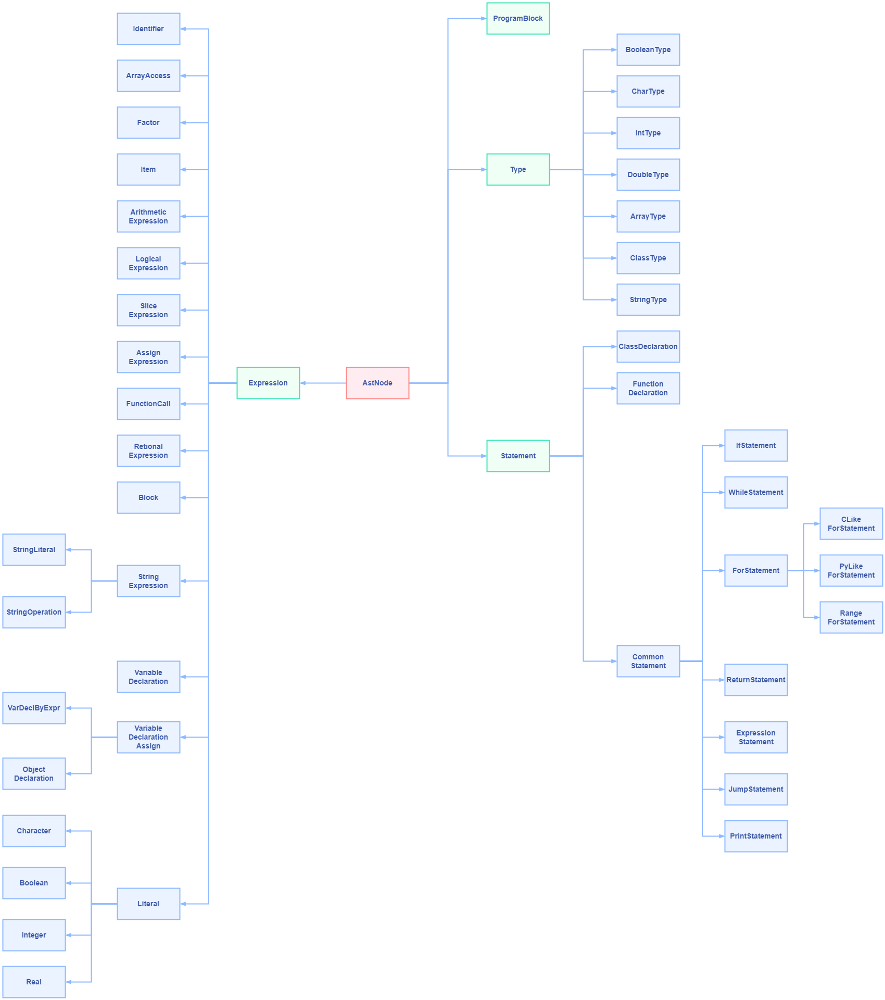

# 1 设计背景和思路

## 1.1 背景

&emsp;&emsp;随着信息技术的发展，计算机已成为人们学习和生活中不可缺少的一部分。在高等教育中，即使是非计算机专业，学校也往往会在前2学期为学生开设计算机相关的课程。课程内容一般为计算机的通识知识，后来为增加实用性，又出现了越来越多的课程开始教授编程语言，甚至部分非理工科专业也会在大学阶段修读关于编程语言的课程。

&emsp;&emsp;现阶段，大学课堂上教授的最广泛的语言是C/C++、Java和Python，然而，这些语言都是应用广泛的商业型语言，语法规则、特性往往十分复杂、繁多。受限于课时数、语言的复杂程度等原因，学生并不可能在短短一学期的课程中掌握一门语言的全部内容，尤其对于非计算机专业的大部分学生，可能只能掌握语言的基本用法，无法理解更高级的特性。甚至面对规则、特性十分繁杂的语言，产生“被劝退”的副作用。

&emsp;&emsp;所以，我们选择设计一门专门用于教学的编程语言，它集成了C++、Java和Python的最核心部分，去除了其中对于普通学生而言不常用的功能特性，让它作为一门教学语言，能达到“麻雀虽小五脏俱全”的效果。

​		在详细阐述我们的语言的设计前，我们先从教学的角度分析C++、Java和Python的特点：

+ C++
  C++是一门多范型语言，既可以支持面向对象编程，也可以像C语言那样进行纯面向过程的编程。C++最大的特点就是灵活性，我们可以用C++实现几乎任何我们想要的东西。但对于新手而言，灵活性更意味着复杂性，众多的特性会让新手无所适从。例如，光是指针这一内容，就足以专门出一本书去讲解了。另外，C++还有众多不便之处，比如，我们无法对数组进行整体赋值，只能对逐个元素进行赋值；想使用多态的性质，就必须将对象声明为指针类型等。
+ Java
  Java抛弃了C++中一些使人容易犯错的用法，比如指针，从入手难度上看，比C++更加友好。但Java是一门纯面向对象语言，意味着任何事情都是对象，任何方法、变量均需在类里声明和定义。对于新手而言，理解面向对象的编程思想可能并不简单，容易在学习编程的初期产生很多困惑。
+ Python
  与C++和Java相比，Python的语法精简了很多，在很多操作上，也比C++和Java容易，比如列表可以进行切片操作、有乘方运算符“**”等。但Python作为一门解释型的动态类型语言，也存在一些缺点。比如，性能相对较差，语法混乱（不同版本之间的语法可能不兼容）等。

整个项目开源于：[https://github.com/Yunshiyue/myPL](https://github.com/Yunshiyue/myPL)

## 1.2 设计思路

- 对Java和C++中有关类的语法和语义进行精简并结合
- 加入一些Python中常用且方便的操作
- 加入一些常用的高级特性，如模板等

## 1.3 语言特性

​		综合C++、Java和Python的特点，我们的语言具有以下特性：

+ 是一门多范型语言，既可以支持面向对象编程，也可以支持面向过程编程
+ 抛弃指针。简化多态特性，所有的方法均为动态绑定
+ 数组成为一种类型，可以整体赋值，并支持切片操作
+ 支持常用的便捷操作，如乘方运算符、取整运算符、范围for循环等，并将字符串作为一种基本类型
+ 支持函数模板

# 2 词法和语法描述

## 2.1 词法

### 2.1.1 关键字

&emsp;&emsp;本语言综合C++、Java和Python中的一些词法约束，并去掉了一些了我们不需要的内容。我们的关键字的EBNF如下：

```ebnf
# 关键字
keyword ::= 'if' | 'else' | 'elif' | 'while' | 'this' | 'public' | 'private' | 'protected' | 'extends' | 'null' |
'def' | 'class' | 'return' | 'break' | 'continue' | 'template' | 'typename';
```

### 2.1.2 基本类型及其字面值

&emsp;&emsp;与C++、Java和Python类似，本语言的基本类型有bool、char、int、float、double。与之不同的是：  
（1）我们把字符串string类型设置为一个基本类型，而不是像C++和Java一样是一个对象；  
（2）我们新增数组类型array，方便用户直接对数组进行赋值等一些基本操作。

&emsp;&emsp;基本类型的EBNF如下：

```ebnf
# 基本类型
value-type ::= <bool> | <int> | <float> | <double> | <char> | <string> | <array>;
bool ::= 'bool';
int ::= 'int';
float ::= 'float';
double ::= 'double';
char ::= 'char';
string ::= 'string';
array ::= 'array' '<' <value-type> ',' <integer> '>';
```


### 2.1.3 运算符

&emsp;&emsp;运算符分为算术运算符、逻辑运算符和关系运算符，其中算术运算符又分为加法运算符和乘法运算符。  
&emsp;&emsp;参考Python，本语言引入了乘方运算符“**”和取整运算符“//“。  
&emsp;&emsp;EBNF如下：

```ebnf
# 加法运算符
addition-operation ::= '+' | '-';

# 乘法运算符
multiplication-operator ::= '*' | '/' | '%' | '**' | '//';

# 逻辑运算符
logical-operator ::= '&&' | '||';

# 关系运算符
relational-operation ::= '>' | '>=' | '<' | '<=' | '==' | '!=';
```

### 2.1.4 标识符

&emsp;&emsp;关键字以字母或下划线开始，由字母、数字和下划线组成，EBNF如下：

```ebnf
# 标识符
identifier ::= [<letter> | '_'] {<letter> | <digit> | '_'};
digit ::= '0' | '1' | '2' | '3' | '4' | '5' | '6' | '7' | '8' | '9';
letter ::= 'a' | 'b' | 'c' | 'd' | 'e' | 'f' | 'g' | 'h' | 'i' | 'j' | 'k' | 'l' | 'm' | 
'n' | 'o' | 'p' | 'q' | 'r' | 's' | 't' | 'u' | 'v' | 'w' | 'x' | 'y' | 'z' | 'A' |
'B' | 'C' | 'D' | 'E' | 'F' | 'G' | 'H' | 'I' | 'J' | 'K' | 'L' | 'M' | 'N' | 
'O' | 'P' | 'Q' | 'R' | 'S' | 'T' | 'U' | 'V' | 'W' | 'X' | 'Y' | 'Z';
```

## 2.2 语法

### 2.2.1 程序

&emsp;&emsp;程序由多条语句构成。本语言为多范型语言，支持面向对象和面向过程编程，所以可在类外部定义变量、函数等。EBNF如下：

```ebnf
# 程序
program ::= <statement>+;
statement ::= <function-declaration> | <class-declaration> | <variable-declaration> | <common-statement>;
```

### 2.2.2 函数声明

&emsp;&emsp;由于本语言支持面向对象编程，变量的类型可以为类类型，所以类型由基础类型和类类型构成，EBNF如下：

```ebnf
type ::= <value-type> | <identifier>;
```

&emsp;&emsp;函数由函数头和函数体构成。本语言支持函数模板，可在函数头开头使用“template”关键字声明模板。返回类型尾置，如果不需要返回值，则无需写返回类型。函数体由基本语句构成。EBNF如下：

```ebnf
# 函数声明（注意模板）
function-declaration ::= <function-head><function-body>;
function-head ::= ['template' '<' 'typename' <identifier> '>'] 'def' <identifier> '(' <foraml-parameter-list> ')' ['->' <type>];
function-body ::= '{' <statement-list> '}';
foraml-parameter-list ::= <type> <identifier> {','<type> <identifier>} | null;
statement-list ::= <common-statement>*;
```

### 2.2.3 类声明

&emsp;&emsp;类声明由类头和类体构成。本语言支持类模板，可在类头的初始位置使用“template”关键字声明模板。为使语言容易理解且规避多继承带来的问题，本语言只支持单继承，可在类头中使用“extends”表明继承的父类。    
&emsp;&emsp;本语言参考了C++和Java的面向对象机制，支持继承，在类体中可以用访问限制控制符“public”、“private”和“protected”声明块。  
&emsp;&emsp;EBNF如下：

```ebnf
# 类声明（注意模板）
class-declaration ::= <class-head> <class-body>;
class-head ::= ['template' '<' 'typename' <identifier> '>'] 'class' <identifier> ['extends' <identifier>];
class-body ::= '{' {public-block} {protected-block} {private-block} '}' ';';
public-block ::= 'public:' <class-statement-list>;
protected-block ::= 'protected:' <class-statement-list>;
private-block ::= 'private:' <class-statement-list>;
class-statement-list ::= {<function-declaration> | <variable-declaration>};
```

### 2.2.4 变量声明

&emsp;&emsp;变量声明时，可以选择是否赋予初值。  
&emsp;&emsp;在声明类类型时，本语言参考了Java的做法，所有类类型均动态分配。但Java中没声明一个对象，就要使用“new”关键字，比较繁琐，因此本语言简化了类类型对象的声明，如同C++中的直接构造那样，在标识符后面附加参数列表完成构造。  
&emsp;&emsp;由于本语言支持类模板，在定义模板类的对象时，需在类型名后面使用“<>”表明模板类型。  
&emsp;&emsp;EBNF如下：

```ebnf
# 变量声明
variable-declaration ::= <type>['<' <type> '>'] <identifier> ';'|
                         <type>['<' <type> '>'] <identifier> '=' <expression> ';' |
                         <type>['<' <type> '>'] <identifier> '=' <identifier> ';' |
                         <type>['<' <type> '>'] <identifier> '(' <actual-parameter-list> ')' ';';
```

### 2.2.5 语句

&emsp;&emsp;普通语句分为if语句、while语句、for语句、变量声明、返回语句、表达式语句和jump语句。EBNF如下：

```ebnf
# 普通语句
common-statement ::= <if-statement> | <while-statement> | <for-statement> | <variable-declaration> | ;
                     <return-statement> | <expression-statement> | <jump-statement>;
```

#### 2.2.5.1 if语句

&emsp;&emsp;在if语句中，本语言参考Python语言的elif关键字，不再需要else if表明分支。EBNF如下：

```ebnf
# if语句
if-statement ::= 'if' '(' <relation-expression> ')' '{' <statement-list> '}'
                {'elif' '(' <relation-expression> ')' '{' <statement-list> '}'} {'else' '{' <statement-list> '}'};
```

#### 2.2.5.2 while语句

&emsp;&emsp;jump语句一般用于循环控制，本语言支持使用“break”和“continue”控制循环。EBNF如下：

```ebnf
# jump语句
jump-statement ::= 'break' ';' | 'continue' ';';

# while语句
while-statement ::= 'while' '(' <relation-expression> ')' '{' <statement-list>  '}';
```

#### 2.2.5.3 for语句

&emsp;&emsp;本语言参考C++、Java和Python中的for语句，丰富了for语句的语法。for语句支持：  
（1）像Python那样，使用“in”表示循环控制变量的范围，区间为左闭右开；  
（2）像C++和Java那样普通的for循环；  
（3）范围for循环。  
&emsp;&emsp;EBNF如下：

```ebnf
for-statement ::= 'for' <identifier> 'in' '(' <expression> ',' <expression> ')' '{' <statement-list> '}' |
                  'for' '(' [<variable-declaration> | <assign-expression>]';' [<relation-expression>] ';' [<assign-expression>]')' 
                  '{' <statement-list> '}' |
                  'for' '(' <type> <identifier> 'in' <identifier>')' '{' <statement-list> '}';
```

#### 2.2.5.4 返回语句

&emsp;&emsp;返回语句支持返回一个表达式或者不返回值，EBNF如下：

```ebnf
# 返回语句
return-statement ::= 'return' [<expression>] ';';
```

#### 2.2.5.5 表达式语句

&emsp;&emsp;每个表达式均可构成一条语句，EBNF如下：

```ebnf
# 表达式语句
expression-statement ::= <expression> ';';
```

### 2.2.6 表达式

&emsp;&emsp;表达式的类型分为逻辑表达式、算术表达式、字符串表达式、切片表达式和赋值表达式，EBNF如下：

```ebnf
# 表达式
expression ::= <logical-expression> | <arithmetic-expression> | <string-expression> | 
                <slice-expression> | <assign-expression>;
```

### 2.2.6.1 赋值表达式

&emsp;&emsp;赋值表达式使用“=”对变量进行赋值，本语言的数组为基础类型，所以既可以对数组中的元素进行单独赋值，也可以对数组进行整体赋值。EBNF如下：

```ebnf
# 赋值表达式
assign-expression ::= <identifier> {'[' <expression> ']'} '=' <expression>;
```

### 2.2.6.2 字符串表达式

&emsp;&emsp;本语言将字符串作为一种基本类型，并为string类型内置了一些基本操作：  
（1）使用substr返回子字符串；  
（2）使用reverse倒置字符串；  
（3）使用title将字符串中每个单词的首字母大写；  
（4）使用uppercase将字符串中的所有字母大写；  
（5）使用lowercase将字符串中的所有字母小写。  
&emsp;&emsp;EBNF如下：

```ebnf
# 字符串表达式
string-expression ::= <string-literal> | <identifier> | <string-operation> | <function-expression>;
string-operation ::= <string-expression> '+' <string-expression> |
                    <string-expression> '.' 'substr' '(' <expression> ',' <expression> ')' |
                    <string-expression> '.' 'reverse' |
                    <string-expression> '.' 'title' |
                    <string-expression> '.' 'uppercase' |
                    <string-expression> '.' 'lowercase';
```

### 2.2.6.3 切片表达式

&emsp;&emsp;本语言参考Python语言，引入切片机制，可以使用方括号和冒号的搭配返回一个新的数组，新数组的元素为原数组指定区间内的元素。EBNF如下：

```ebnf
# 切片表达式，返回一个数组
slice-expression ::= <identifier> '[' [<expression>] ':' [<expression>] ']';
```

### 2.2.6.4 算术、逻辑和关系表达式

&emsp;&emsp;本语言与运算有关的表达式包括算术表达式、逻辑表达式和关系表达式，EBNF如下：

```ebnf
# 算术表达式
arithmetic-expression ::= ['+' | '-'] <item> { <addition-operator> <item> };
addition-operation ::= '+' | '-';

# 逻辑表达式（包括逻辑运算和关系运算）
logical-expression ::= <factor> { <logical-operator> <factor>};
logical-operator ::= '&&' | '||';

# 关系表达式
relational-expression ::= <arithmetic-expression> <relational-operator> <arithmetic-expression>;
relational-operation ::= '>' | '>=' | '<' | '<=' | '==' | '!=';

# 项
item ::= <factor> { <multiplication-operator> <factor> };
multiplication-operator ::= '*' | '/' | '%' | '**' | '//';

# 因子（标识符、数组、括号表达式、字面值常量、函数表达式）
factor ::= <identifier> | <identifier> { '[' <expression> ']' } | '(' <expression> ')' | 
            <literal> | <function-expression> | <relational-expression>;
```


# 3 典型语言机制的语义描述

## 3.1 存储域

+ 语义函数
	$Store = Location \rightarrow ( stored\ Storable + undefined + unused )$
+ 辅助函数
	$empty\_store : Store$
	$allocate : Store \rightarrow Store \times Location$
	$deallocate : Store \times Location \rightarrow Store$
	$update : Store \times Location \times Storable \rightarrow Store$
	$fetch : Store \times Location \rightarrow Storable$
+ 辅助函数的形式化定义
	$empty\_store : \lambda loc.unused$
	$allocate\ sto =$
		$let$
			$loc = any\_unused\_location(sto)$
		$in$
			$(sto [loc \rightarrow undefined], loc)$ 
	$deallocate (sto, loc) = sto [loc \rightarrow unused]$
	$update (sto, loc, stble) = sto [loc \rightarrow stored stble]$
	$fetch (sto, loc) =$
		$let$
			$stored\_value (stored\ stble) = stble$    
			$stored\_value (undefined) = fail$
			$stored\_value (unused) = fail$ 
		$in$
			$stored\_value(sto(loc))$

## 3.2 环境域

+ 语义函数
	$Environ = Identifier \rightarrow (bound\ Bindable + unbound)$
+ 辅助函数
	$empty\_environ : Environ$
	$bind : Identifier \times Bindable \rightarrow Environ$
	$overlay : Environ \times Environ \rightarrow Environ$
	$find : Environ \times Identifier \rightarrow Bindable$
	$coerce : Store \times Bindable \rightarrow Value$
+ 辅助函数的形式化定义
	$empty\_environ = \lambda I.unbound$
	$bind (I, bdble) = \lambda I’. if\ I’ = I\ then\ bound\ bdble\ else\ unbound$
	$overlay (env’, env) = \lambda I.\ if\ env’(I)\ \neq\ unbound\ then\ env’(I)\ else\ env(I)$
	$find(env, I) =$
		$let$
			$bound\_value(bound\ bdble) = bdble$
			$bound\_value(unbound) = \perp$
		$in$
			$bound\_value(env(I))$
	$coerce (sto, find(env, I)) =$
		$val$ （如果I束定于val常量）
		$|fetch(sto,loc)$ （如果I束定于变量地址）

## 3.3 语义域

### 3.3.1 语义域定义

+ 先定义语言所有操作数的值构成的域，定义为Value，：
	$Value = truth\_value\ Truth\_Value + integer\ Interger + float\ Float + double\ Real + char\ Char + string\_value\ String\_Value + array\_value\ Array\_Value$
	其中String_Value以及Array_Value都属于序列域，其定义如下，String的元素的值的类型只能为char，而Array的元素的值的类型为除了数组之外的所有元素的类型：
	+ $String\_Value = Char\_Value^{*}$
	+ $Array\_Value = (Value - Array\_Value)^{*}$（Value域中除了Array_Value的其它域构成的联合域）
+ 再定义可存储单元的域，定义为Strorable。因为数组元素可以个别更新，所以数组的存储仍然是数组元素的单独存储。而对于字符串而言，我们有取子串的操作（subStr），所以也需要以元素(char)形式单独存储。语言的可存储值域为：
	$Storable = truth\_value\ Truth\_Value + integer\ Interger + float\ Float + double\ Real + char\ Char$
+ 接着定义变量域，变量域中有简单变量也有数组变量以及字符串变量，字符串变量，我们将变量与定义为Variable：
	$Variable = simple\_variable\ Location + sring\_variable\ String\_Variable + array\_variable\ Array\_Variable$
	其中String_Variable以及Array_Variable都属于序列域，其定义如下：
	+ $String\_Variable = Location^{*}$
	+ $Array\_Variable = Location^{*}$
+ 最后定义可束定体构成的域，我们将其定义为Bindable，在我们的语言中，第一类值、变量以及函数是可束定体：
	$Bindable = value\ Value + variable\ Variable + function\ Function$

### 3.3.2 域以及域中元素的对照表

在进行之后的辅助函数以及指称语义的定义之前，我们先总结一下我们目前定义的主要的语义域以及其域中元素代称的对照关系
+ | 域         | 域中元素代称 | 说明                   |
  | :--------- | ------------ | ---------------------- |
  | Store      | sto          | 存储域                 |
  | Location   | loc          | 存储域中的位置构成的域 |
  | Storable   | stble        | 可存储值构成的域       |
  | Identifier | I            | 标识符构成的域         |
  | Bindable   | bdble        | 可绑定值构成的域       |
  | Value      | val          | 第一类值构成的域       |
  | Variable   | var          | 变量构成的域           |

### 3.3.3 常用的语义函数

+ 表达式求值的语义函数
	$evaluate : Expression \rightarrow (Environ \rightarrow Store \rightarrow Value)$
	具体可写为：
	$evaluate[E]\ env\ sto =...$
+ 声明确立的语义函数
	$elaborate: Declaration \rightarrow (Environ \rightarrow Store \rightarrow Environ\times Store)$
	具体可写为：
	$elaborate[D]\ env\ sto=(env',sto')$
+ 执行命令的语义函数
	$execute: Command \rightarrow (Environ \rightarrow Store \rightarrow Value)$
	具体可写为：
	$execute[C]\ env\ sto = sto'$

## 3.4 指称语义

下面给出各语法部分的语义函数以及辅助函数定义。

### 3.4.1 基本运算

因为并不是所有的第一类值均可以参与算数运算，所以我们定义可参与算术运算的域，记为Cal_Value:
$Cal\_Value =  integer\ Interger + float\ Float + double\ Real + char\ Char)$

#### 3.4.1.1 语法定义

```
# 算术表达式
arithmetic-expression ::= ['+' | '-'] <item> { <addition-operator> <item> }
addition-operation ::= '+' | '-'

# 逻辑表达式（包括逻辑运算和关系运算）
logical-expression ::= <factor> { <logical-operator> <factor>}
logical-operator ::= '&&' | '||'

# 关系表达式
relational-expression ::= <arithmetic-expression> <relational-operator> <arithmetic-expression>
relational-operation ::= '>' | '>=' | '<' | '<=' | '==' | '!='

# 项
item ::= <factor> { <multiplication-operator> <factor> }
multiplication-operator ::= '*' | '/' | '%' | '**' | '//'

# 因子（标识符、数组、括号表达式、字面值常量、函数表达式）
factor ::= <identifier> | <identifier> { '[' <expression> ']' } | '(' <expression> ')' | <literal> | <function-expression> | <relational-expression>
```

#### 3.4.1.2 辅助函数

+ 算数运算
	进行算数运算的常量类型相同。
	求和：$sum: Cal\_Value \times Cal\_Value \rightarrow Cal\_Value$
	减法：$difference: Cal\_Value \times Cal\_Value \rightarrow Cal\_Value$
	乘法：$product: Cal\_Value \times Cal\_Value \rightarrow Cal\_Value$
	除法：$divide: Cal\_Value \times Cal\_Value \rightarrow Cal\_Value$
	取模：$mod: Cal\_Value \times Cal\_Value \rightarrow Integer$
	乘方：$inv: Cal\_Value \times Cal\_Value \rightarrow Cal\_Value$
+ 逻辑运算
	只有Truth_Value类型的常量才可以进行逻辑运算
	与运算：$and: Truth\_Value \times Truth\_Value \rightarrow Truth\_Value$
	或运算：$or: Truth\_Value \times Truth\_Value \rightarrow Truth\_Value$
+ 关系运算
	参与关系运算的常量类型也需要相同。
	大于：$gt : Cal\_Value \times Cal\_Value \rightarrow Truth\_Value$
	大于等于：$ge : Cal\_Value \times Cal\_Value \rightarrow Truth\_Value$
	小于：$lt : Cal\_Value \times Cal\_Value \rightarrow Truth\_Value$
	小于等于：$le : Cal\_Value \times Cal\_Value \rightarrow Truth\_Value$
	等于：$eq : Cal\_Value \times Cal\_Value \rightarrow Truth\_Value$
	不等于：$neq : Cal\_Value \times Cal\_Value \rightarrow Truth\_Value$
+ 因子取值
	由于我们支持数组的整体运算，所以我们有数组整体取值和更新（在下一小节）的辅助函数
	$fetch\_array: Store \times Array\_Variable \rightarrow Array\_Value$
	接着我们同样给出字符串整体取值的辅助函数
	$fetch\_string: Store \times String\_Variable \rightarrow String\_Value$
	为了实现取出数组中的单个值，我们需要有对数组变量作索引的辅助函数
	$component: Integer \times Array\_Variable \rightarrow Variable$
	最后我们给出求得Bindable域（即变量即常量域的混合域）中所有变量常量值的辅助函数
	$fetch\_bdble: Store \times Bindable \rightarrow Value$
	
	

#### 3.4.1.3 辅助函数的形式化定义

```java
/* 
对于基础运算函数的辅助话函数进行形式化定义有重复定义的嫌疑
所以我们在这里只对逻辑运算的辅助函数进行形式化定义
*/
and(tr1, tr2)=
	if tr1 == truth_value true
		then
		if tr2 == truth_value true
			then
			truth_value true
		else truth_value false
	else truth_value false

and(tr1, tr2)=
	if tr1 == truth_value false
		then
		if tr2 == truth_value false
			then
			truth_value false
		else truth_value true
	else truth_value true

fetch_array(sto, nil) = nil
fetch_array(sto, var·arrvar) =
	fetch(sto, var)·fetch_array(sto, arrvar)

fetch_string(sto, nil) = nil
fetch_string(sto, var·stringvar) = 
	fetch(sto, var)·fetch_string(sto, stringvar)
	
component(int, nil) = ⊥
component(int, var·arrvar) = 
	if int = 0 then var
	else component(int-1, arrvar)

fetch_bdble(sto, value val) = val
fetch_bdble(sto, simple_variable loc) = fetch(sto, loc)
fetch_bdble(sto, array_variable arrvar) = fetch_array(sto, arrvar)
fetch_bdble(sto, string_variable stringvar) = fetch_string(sto, stringvar)
```

#### 3.4.1.4 指称语义

```java
// 算数运算
evaluate[E1 + E2] env sto = 
    let Cal_Value cv1 = evaluate E1 env sto in
    let Cal_Value cv2 = evaluate E2 env sto in
    Cal_Value(sum(cv1,cv2))
evaluate[E1 - E2] env sto = 
    let Cal_Value cv1 = evaluate E1 env sto in
    let Cal_Value cv2 = evaluate E2 env sto in	
    Cal_Value(difference(cv1,cv2))
evaluate[E1 * E2] env sto = 
    let Cal_Value cv1 = evaluate E1 env sto in
    let Cal_Value cv2 = evaluate E2 env sto in	
    Cal_Value(product(cv1,cv2))
evaluate[E1 / E2] env sto = 
    let Cal_Value cv1 = evaluate E1 env sto in
    let Cal_Value cv2 = evaluate E2 env sto in	
    Cal_Value(divide(cv1,cv2))
evaluate[E1 % E2] env sto = 
    let Cal_Value cv1 = evaluate E1 env sto in
    let Cal_Value cv2 = evaluate E2 env sto in	
    Integer(mod(cv1,cv2))
evaluate[E1 ** E2] env sto = 
    let Cal_Value cv1 = evaluate E1 env sto in
    let Cal_Value cv2 = evaluate E2 env sto in	
    Cal_Value(inv(cv1,cv2))
// 逻辑运算
evaluate[E1 && E2] env sto = 
	let Truth_Value tr1 = evaluate E1 env sto in
	let Truth_Value tr2 = evaluate E2 env sto in
	Truth_Value(and(tr1,tr2))
	
evaluate[E1 || E2] env sto = 
	let Truth_Value tr1 = evaluate E1 env sto in
	let Truth_Value tr2 = evaluate E2 env sto in
	Truth_Value(or(tr1,tr2))
// 关系运算
evaluate[E1 > E2] env sto =
	let Cal_Value cv1 evaluate E1 env sto in
    let Cal_Value cv2 evaluate E2 env sto in
    Truth_Value(gt(E1, E2))
evaluate[E1 >= E2] env sto =
	let Cal_Value cv1 evaluate E1 env sto in
    let Cal_Value cv2 evaluate E2 env sto in
    Truth_Value(ge(E1, E2))
evaluate[E1 < E2] env sto =
	let Cal_Value cv1 evaluate E1 env sto in
    let Cal_Value cv2 evaluate E2 env sto in
    Truth_Value(lt(E1, E2))
evaluate[E1 <= E2] env sto =
	let Cal_Value cv1 evaluate E1 env sto in
    let Cal_Value cv2 evaluate E2 env sto in
    Truth_Value(le(E1, E2))
evaluate[E1 == E2] env sto =
	let Cal_Value cv1 evaluate E1 env sto in
    let Cal_Value cv2 evaluate E2 env sto in
    Truth_Value(eq(E1, E2))
evaluate[E1 != E2] env sto =
	let Cal_Value cv1 evaluate E1 env sto in
    let Cal_Value cv2 evaluate E2 env sto in
    Truth_Value(neq(E1, E2))
// 因子求值
evaluate[I] env sto =
	let bdble = find(env, I) in
    fetch_bdble(sto, bdble)
evaluate[I[E]] env sto =
	let val = evaluate E env sto in
	let array_variable arrar = fetch_bdble(sto, find(env,I)) in
	fetch_bdble(sto, component(val, arrar))

```

### 3.4.2 赋值语句

#### 3.4.2.1 语法定义

```java
# 赋值语句（数组可以直接赋值）
assign-statement ::= <identifier> {'[' <expression> ']'} '=' <expression> ';'

```
#### 3.4.2.2 辅助函数

+ 对于数组整体的更新
	$update\_array: Store \times Array\_Variable \times Array_Value \rightarrow Store$
+ 对于字符串的更新，我们可能需要考虑字符串长度的问题，所以我们可能需要在赋值时分配存储空间或者回收空间
	$update\_string: Store \times String\_Variable \times String\_Value \rightarrow Store$
	$recycle\_string: Store \times String\_Variable \rightarrow Store$
+ 最后我们给出对所有变量的更新的辅助函数
	$update\_variable: Store \times Variable \times Value \rightarrow Store$

#### 3.4.2.3 辅助函数的形式化定义

```java
update_array(sto, nil, nil) = sto
update_array(sto, var·arrvar, val·arrval) = 
	let sto' = update(sto, var, val) in
	update_array(sto',arrvar, arrval)
	
recycle_string(sto, nil) = sto
recycle_string(sto, var·strvar) = 
	let sto' = deallocate(sto, var) in
	recycle_string(sto, strvar)

update_string(sto, nil, nil) = sto
// 如果赋值前的字符串比赋值后的长，需要给结尾添加nil并将之后的字符串都设为未使用
update_string(sto, var.strvar, nil) = 
	let sto' = update(sto, var, nil) in
	revcycle_string(sto', strvar)
// 如果赋值前的字符串比赋值后的短，需要边分配空间边赋值
update_string(sto, nil, val·strval) =
	let (sto', loc) = allocate(sto) in
	let sto'' = update(sto', loc, val) in
	update_string(sto'', nil, strval)
update_string(sto, var·strvar, val·strval) = 
	let sto' = update(sto, var, val) in
	update_string(sto', strvar, strval)

update_variable(sto, simple_variable loc, val) = update(sto, loc, val)
update_variable(sto, array_variable arrvar, array_value arrval) = update_array(sto, var·arrvar, val·arrval)
update_variable(sto, string_variable strvar, string_value strval) = update_string(sto, var·strvar, val·strval)
```
#### 3.4.2.4 指称语义

```java
execute [I = E] env sto = 
	let val = evaluate E env sto in
	let variable var = find(env, I) in
	update_variable(sto, var, val)

execute [I[E] =  E'] env sto = 
	let integer val = evaluate env sto in
	let val' = evaluate env sto in
	let vatiable var = component(val, find(env, I)) in
	update_variable(sto, var, val)
```

### 3.4.3 选择语句

#### 3.4.3.1 语法定义

```java
# if语句
if-statement ::= 'if' '(' <expression> ')' '{' <statement-list> '}' 
                {'elif' ' '(' <expression> ')' ''{' <statement-list> '}'} {'else' '{' <statement-list> '}'}
```

#### 3.4.3.2 指称语义

```java
execute [if (E1) {SL1} elif (E2) {SL2} else {SL3}] env sto = 
	if evaluate E1 env sto == truth_value true
		then
		execute SL1 env sto
	else
		if evaluate E2 env sto == truth_value true
			then
			execute SL2 env sto
		else execute SL3 env sto
```

### 3.4.4 循环语句

#### 3.4.4.1 语法定义

```java
# while语句
while-statement ::= 'while' '(' <relation-expression> ')' '{' <statement-list>  '}'
jump-statement ::= 'break' ';' | 'continue' ';'

# for语句（类似python的循环、C++的循环、范围循环）
for-statement ::= 'for' <identifier> 'in' '(' <expression> ',' <expression> ')' '{' <statement-list> '}' |
                  'for' '(' [<variable-declaration> | <assign-statement>]';' [<expression>] ';' [<assign-expression>]')' 
                  '{' <statement-list> '}' |
                  'for' '(' <type> <identifier>'in' <identifier>')' '{' <statement-list> '}'
```

#### 3.4.4.2 指称语义

```java
execute[while (RE) {SL}] env sto =
	let execute_while env sto = 
		if evaluate RE env sto == truth_value true
			then
			execute_while env (execute SL env sto)	//每次执行statement-lsit后存储环境都会改变
		else sto
	in
	execute_while

execute[for I in (E1, E2) {SL}] env sto =
	let execute_for env sto = 
		let val1 = evaluate E1 env sto in
		let val2 = evaluate E2 env sto in
		let variable var = find(env, I) in
		let value curI = fetch_bindable(sto, var) in	//I现在的值
		if and(ge(curI, val1), lt(curI, val2)) == truth_value true
			then
			let sto' = execute SL env sto in
			let sto'' = update_variable(sto', var, add(curI, 1)) in	//执行I++
			execute_for env sto''
		else sto
	in
	execute_for

execute[for (VD;RE;AE) {SL}] env sto =
	let (env', sto') = execute VD env sto in
	let execute_for env' sto' =
		if evaluate RE env' sto' == truth_value true
			then
			execute_for env' (execute AE env' (execute SL env' sto'))
		else sto'
	in
	excute_for env' sto'

execute[for (AS;RE;AE) {SL}] env sto =
	let sto' = execute AS env sto in
	let execute_for env' sto' =
		if evaluate RE env' sto' == truth_value true
			then
			execute_for env' (execute AE env' (execute SL env' sto'))
		else sto'
	in
	execute_for env' sto'

// 这种形式的for循环我们规定I2绑定的一定是数组首地址，I1的类型为数组内子元素的类型
execute[for (type I1 in I2) {SL}] env sto =
	let (sto', var1) = allocate(sto) in
	let env' = bind(I1, var1) in
	let array_variable var·arrvar = find(env' I2) in
	let execute_for env' sto' =
		if neq(var, nil) == truth_value true
			then
			let var1 = var in
			let sto'' = execute SL env' sto' in
			let var.arrvar = arrvar in //I1取下一个元素，此处的sto应该要发生变化的
			execute_for env' sto''
		else sto'
	in
	execute_for env' sto'
```

### 3.4.5 变量声明语句

#### 3.4.5.1 语法定义

```java
# 变量声明
variable-declaration ::= <type> ['<' <type> '>'] <identifier> ';'|
                         <type> ['<' <type> '>'] <identifier> '=' <expression> ';' |
                         <type> ['<' <type> '>'] <identifier> '=' <identifier> ';' 
```

#### 3.4.5.2 指称语义

```java
elaborate [type I] env sto =
	let (sto', loc) = allocate(sto) in
	let env' = bind(I, loc) in
	(env', sto')

elaborate [type I = E] env sto =
	let val = evaluate E env sto in
	let (sto', loc) = allocate(sto) in
	let env' = bind(I, loc) in
	let sto'' = update_variable(sto', loc, val) in
	(env', sto'')

elaborate [type I1 = I2] env sto = 
	let val = fetch_bindable(sto, find(env, I2)) in
	let (sto', loc) = allocate(sto) in
	let env' = bind(I, loc) in
	let sto'' = update_variable(sto', loc, val) in
	(env', sto'')
```

### 3.4.6 函数

#### 3.4.6.1 语法定义

```java
# 函数声明（注意模板）
function-declaration ::= <function-head><function-body>
function-head ::= ['template' '<' 'typename' <identifier> '>'] 'def' <identifier> '(' <foraml-parameter-list> ')' ['->' <type>]
function-body ::= '{' <statement-list> '}'
foraml-parameter-list ::= <type> <identifier> {','<type> <identifier>} | null
statement-list ::= <common-statement>*
# 返回语句
return-statement ::= 'return' [<expression>] ';'
```
#### 3.4.6.2 辅助函数
+ 按指称语义的观点，函数也是一个论域：
	$Function = Argument \rightarrow Store \rightarrow Value$
+ 我们接着对函数的变元域进行详细的定义，这个变元域其实就是第一类值域加上变量域：
	$Argument = value\ Value + variable\ Variable$
+ 对于函数内部而言，其与一般的命令式语言没有什么区别，所以我们增加的辅助函数和域主要是用于函数调用方面。
	bind_parameter的作用是将变元与对应的地址进行绑定
	give_argument的作用是将参数对应的值传给变元
	$bind\_parameter: Formal\_Parameter \rightarrow (Argument \rightarrow Environ)$
	$give\_argument: Actual\_Parameter \rightarrow (Environ \rightarrow Argument)$
+ 在我们的语言中，我们有函数模板的概念，所以我们需要有绑定类型和替换类型两个辅助函数，这两个辅助函数主要改变对应的变量类型，所以不会改变环境和存储
	$bind_type: Formal\_Parameter \rightarrow ( Environ \rightarrow Argument \rightarrow  Environ )$
	$give_type: Actual\_Parameter \rightarrow ( Environ \rightarrow Argument \rightarrow  Environ )$
+ 在上面的讨论中，我们假设一个函数只有一个变元，但实际上，一个函数会有多个变元，因此，我们需要设计一个序列域：
	$ArgumentList = Argument*$
+ 增加了变元数量后，对应的辅助函数也需要进行修改，但在这里我们就不进行进一步定义了。

#### 3.4.6.3 辅助函数的形式化定义

```java
bind_parameter [type I] =
	let (sto', loc) = allocate(sto) in
	bind(I, loc)
bind_type <typename I> env = env'

give_argument [E] env = evaluate E env
give_type <typename I> env = env'
```
#### 3.4.6.4 指称语义

```java
elaborate [def I(FP) -> T {SL}] env =
	let func arg =
		let parenv = bind_parameter FP arg in
		execute SL (overlay(parenv, env))
	in
	bind(I, func)

elaborate [template<typename I> def I(FP) -> T {SL}] env =
	let func arg =
		let env' = bind_type I env in
		let parenv = bind_parameter FP arg env' in
		execute SL (overlay(parenv, env))
	in
	bind(I, func)

// 有返回值的函数调用的计算
evaluate [I(AP)] env = 
	let funtion func = find(env, I) in
	let arg = give_argument AP env in
	func arg

evaluate [template<typename T>I(AP)] env =
	let env' = give_type T env in
	let function func = find(env', I) in
	let arg = give_argument AP env' in
	func arg
```

# 4 词法分析器设计

​		我们的词法分析采用flex完成，在github仓库中的qwq.l文件中。词法分析器的主要功能是将程序文本中的词识别分类后以token的形式传递给语法分析器，token的定义在下面进行展示。

## 4.1 yylval类型定义（qwq.yy）

```c++
%union {
    // TODO: 根据定义的节点class完善union
    qwq::AstNode *astNode;
    qwq::ClassDeclaration *cDeclare;
    qwq::ClassHead *classHead;
    qwq::CommonStatement *cStatement;
    qwq::ForStatement *forStatement;
    qwq::Expression *expr;
    qwq::ArrayAccess *arrAcc;
    qwq::RelationalExpression *relationExpr;
    qwq::SliceExpression *sliceExpr;
    qwq::FunctionCall *funcExpr;
    qwq::AssignExpression *assignExpr;
    qwq::FunctionDeclaration *fDeclare;
    qwq::FunctionHead *fHead;
    qwq::Literal *literal;
    qwq::Statement *stmt;
    qwq::StringExpression *sExpr;
    qwq::Block *block;
    qwq::Type *type;
    qwq::Identifier *ident;
    qwq::Item *item;
    qwq::Factor *factor;
    qwq::VariableDeclaration* varDecl;
    qwq::VariableDeclarationAssign *varDeclAssign;
    qwq::ArithmeticExpression *arithExpr;
    qwq::LogicalExpression *logicalExpr;
    qwq::VariableList *varList;
    qwq::StatementList *stmtList;
    qwq::ExpressionList *exprList;
    qwq::ProgramBlock *allStmts;
    long long integer;
    double real;
    int boolean;
    char character;
    std::string *string; // 如果是string就是字符串的内容，如果是identifier就是标识符的名字
    int token;
}
```

## 4.2 token定义

| 终结符、非终结符                   | 对应token            |
| ---------------------------------- | -------------------- |
| ''' . '''                          | TCHAR                |
| '"' \<char>\* '"'                  | TSTRING、TIDENTIFIER |
| 'true'\|'false'                    | TBOOL                |
| ['+'\|'-'] \<digit>+               | TINTEGER             |
| ['+'\|'-'] \<digit>+ '.' \<digit>+ | TREAL                |
| '\*\*'                             | TPOWER               |
| '//'                               | TEDIV                |
| '++'                               | TSADD                |
| '--'                               | TSSUB                |
| '\|\|'                             | TOR                  |
| '&&'                               | TAND                 |
| '=='                               | TEQ                  |
| '!='                               | TNE                  |
| '>='                               | TGE                  |
| '<='                               | TLE                  |
| '+'                                | TADD                 |
| '-'                                | TSUB                 |
| '\*'                               | TMUL                 |
| '/'                                | TDIV                 |
| '%'                                | TMOD                 |
| '!'                                | TNOT                 |
| '>'                                | TGT                  |
| '<'                                | TLT                  |
| 'if'                               | TIF                  |
| 'else'                             | TELSE                |
| 'elif'                             | TELIF                |
| 'for'                              | TFOR                 |
| 'while'                            | TWHILE               |
| 'this'                             | TTHIS                |
| 'public'                           | TPUBLIC              |
| 'private'                          | TPRIVATE             |
| 'protected'                        | TPROTECTED           |
| 'extends'                          | TEXTEND              |
| 'def'                              | TDEF                 |
| 'class'                            | TCLASS               |
| 'return'                           | TRETURN              |
| 'break'                            | TBREAK               |
| 'continue'                         | TCONTINUE            |
| 'int'                              | TINTTK               |
| 'bool'                             | TBOOLTK              |
| 'double'                           | TDOUBLETK            |
| 'char'                             | TCHARTK              |
| 'string'                           | TSTRTK               |
| 'array'                            | TARRTK               |
| 'template'                         | TTEMP                |
| 'typename'                         | TTYNAME              |
| 'substr'                           | TSUBS                |
| 'reverse'                          | TREVS                |
| 'title'                            | TTITLES              |
| 'uppercase'                        | TUPS                 |
| 'lowercase'                        | TLOWS                |

+ 注意：赋值符号=、各种括号、.、,、;没有对应的token

# 5 语法分析器设计

​		我们的语法分析器由bison生成，语法分析器的作用是使用词法分析器识别出来的token序列建立抽象语法树（ast），为下一步抽象语法树的解释运行奠定基础。下面介绍语法分析器中主要的部分。

## 5.1 终结符定义

```C++
// 定义终结符
%token <integer>    TINTEGER
%token <real>       TREAL
%token <boolean>    TBOOL
%token <character>  TCHAR
%token <string>     TSTRING TIDENTIFIER
// 算数运算符
%token <token>      TPOWER TEDIV TSADD TSSUB TADD TSUB TMUL TDIV TMOD
// 逻辑运算符
%token <token>      TAND TOR TNOT
// 比较运算符
%token <token>      TEQ TNE TGE TLE TGT TLT
// 其它运算符
%token <token>      TARROW
// 关键字
// 条件语句
%token <token>      TIF TELSE TELIF
// 循环语句
%token <token>      TFOR TWHILE TIN
// 类
%token <token>      TTHIS TPUBLIC TPRIVATE TPROTECTED TEXTEND TCLASS
// 函数
%token <token>      TDEF TRETURN
// 跳出语句
%token <token>      TCONTINUE TBREAK
// 声明语句
%token <token>      TINTTK TBOOLTK TDOUBLETK TCHARTK TSTRTK TARRTK
// 模板
%token <token>      TTEMP TTYNAME
// 字符串操作
%token <token>      TSUBS TREVS TTITLES TUPS TLOWS

%token <token>      PRINT
```

## 5.2 非终结符定义

```c++
// 定义非终结符
// TODO: 定义非终结符的类型
%type <astNode> program
%type <cDeclare> class-decl
%type <classHead> class-head
%type <cStatement> common-stmt if-stmt while-stmt jump-stmt for-stmt return-stmt expr-stmt var-decl-stmt print-stmt
%type <forStatement> c-like-for py-like-for range-for
%type <expr> expr

%type <arrAcc> arr-access
%type <relationExpr> relation-expr 
%type <sliceExpr> slice-expr
%type <funcExpr> func-expr
%type <assignExpr> assign-expr

%type <fDeclare> func-decl
%type <fHead> func-head
%type <literal> literal
%type <stmt> stmt 
%type <sExpr> str-expr str-operation
%type <block> block
%type <type> type val-type
%type <ident> ident
%type <item> item
%type <factor> factor
%type <varDecl> var-decl
%type <varDeclAssign> var-decl-assign

%type <arithExpr> arithmetic-expr
%type <logicalExpr> logical-expr
// 列表
%type <varList> fp-list
%type <stmtList> stmt-list
%type <exprList> ap-list
%type <allStmts> all-stmt-list
// 操作符
%type <token> addition-opt
%type <token> multi-opt
%type <token> relation-opt
%type <token> logical-opt
```

## 5.3 优先级以及结合性

​		为了解决文法中存在的二义性问题，我们需要对各个token的优先级以及结合性进行定义。

```C++
%right '='
%left TAND TOR
%nonassoc TNOT
%left TADD TSUB
%left TMUL TDIV TEDIV TMOD
%left TPOWER
%nonassoc TSADD TSSUB
```

# 6 抽象语法树节点设计
## 6.1 语法树节点示意图



## 6.2 语法树节点说明

如图所示，AstNode为所有节点的根节点，所有节点都继承于AstNode。

剩余的节点可分为4大类：
+ ProgramBlock

 抽象语法树的开始节点，用于保存程序中的所有语句。

+ Type

 表示语言中的的基本类型，包括boolean、char、int、double、array、class、string。

+ Statement

 包括语言中所有的合法语句，分为类声明、函数声明、普通语句。普通语句包括循环语句、返回语句、表达式语句、跳转语句、打印语句。

+ Expression

 包括语言中支持的所有表达式，分为标识符、数组访问、因子、项、算术表达式、逻辑表达式、切片表达式、赋值表达式、函数调用、关系表达式、语句块、字符串表达式、变量声明、变量声明并定义。


# 7 解释器设计
## 7.1 解释器架构
qwq语言的解释器架构参考eDraw语言。关于解释器的详细代码，见每个类中的eval函数。

+ 符号表

 符号表分为变量符号表和函数符号表。函数符号表存放函数名和函数声明对象（即FunctionDeclaration节点对象）的映射关系，变量符号表存放变量名和变量对应值的映射关系。qwq语言存在函数调用、类、循环、判断语句，所以程序中允许存在多个作用域，每个作用域对应一个本作用域的变量符号表。

+ 程序分析

 每个节点类都有一个用来解释分析当前节点的成员函数（eval函数）。ProgramBlock为语言的开始节点，该节点存放了程序中的所有语句，执行programBlock->eval()后，开始执行成语，通过eval递归地分析执行每一条语句。

## 7.2 部分重要功能实现
因篇幅有限，在这里我们展示qwq语言的创新点。

### 7.2.1 数组实现
qwq语言将数组作为一种基本类型。在解释器的实现中，将一维数组和多维数组都视为一维数组，即数据存放于一个容器中，有一个list存放每一维的大小。数组类含有一个类型枚举变量，指明该数组存放的元素类型，在新建数组时，会根据数组的类型为对应的容器分配存储空间。
```C++
ArrayType type = ArrayType::NONE;
std::vector<int> sizeList;  // 记录每一维的size
std::vector<std::shared_ptr<int>> intData;
std::vector<std::shared_ptr<double>> doubleData;
std::vector<std::shared_ptr<std::string>> stringData;
```

#### 7.2.1.1 数组访问
qwq语言支持多维数组，在访问数组时，若没有任何下标，则返回整个数组。若通过下标访问，则根据下标递归地取出每个子数组，最后得到想要的那个数组或者元素。例如，arr是一个array<array<int, 4>, 5>的二维数组，通过标识符arr访问，会得到整个数组；通过下标[1]访问，会得到一个类型为array<int, 4>的子数组；通过下标[1][3]访问，会先得到一个array<int, 4>的子数组，再从这个子数组中取出第3个元素。

#### 7.2.1.2 数组赋值
+ 单个元素赋值

 通过上述数组访问的方法，可以得到对应单个元素的指针，修改指针存放的值即可。

+ 整体赋值

 qwq语言支持数组整体赋值。2个数组之间可以整体赋值的条件是，它们存放元素的类型相同，元素个数相同。多维数组可以视为数组的数组，所以也可对多维数组中的子数组进行整体赋值。通过上述数组访问的方法，可以得到赋值运算符两端存有2个数组元素的对象，修改被赋值数组的值即可。

#### 7.2.1.3 切片表达式
qwq支持类似Python中的切片表达式。例如，我们通过a是一个int类型数组，通过a[2: 5]访问一个数组，首先解释器得到存放a数组元素的对象，然后取出第2-5个元素，返回一个存有这3个元素的数组对象。简单来说，它会返回一个array<int, 3>的新数组，该数组与其他声明的数组类型无异。

### 7.2.2 字符串相关操作
qwq语言将字符串视为基本类型，并提供了内置操作。解释器在实现时，根据操作类型的不同，分别对字符串的值进行处理。要注意的是，解释器进行操作后，会返回一个新的操作后的字符串，而不会改变原来的字符串。

### 7.2.3 PyLikeFor循环
qwq语言支持类似Python中的for循环，在其之上加以微小的改变，例如：
```python
for i in (1, 10) {
    # 代码块
}
```
这里无需指定i为int类型，也不需要前置声明，解释器会把循环控制变量定义为一个int型的变量，并赋予初值。每次循环结束之时，解释器自动为循环控制变量加1。


# 8 运行方法

## 8.1 获取与安装

+ 首先从github仓库中将代码clone下来
  `git clone git@github.com:Yunshiyue/myPL.git`
+ 接着在根目录下执行
  `cmake -B build`
+ 最后进入build文件夹执行make
  `cd build`
  `make`

## 8.2 对.qwq文件进行解释执行

```bash
# 在build文件夹中执行，fileName表示需要执行的.qwq文件
./myPL fileName -h -t
#where
#-h  help: shows the usage.
#-t  tree: tell qwq to print ast.
```

# 9 结果与测试

## 9.1 变量声明

+ 测试文件
  ```c++
  int i1;
  double i2;
  char i3;
  string i4;
  bool i5;
  array<int, 10> i6;
  
  print("变量声明测试通过");
  
  int j1 = 1;
  double j2 = 1;
  char j3 = '1';
  string j4 = "123";
  bool j5 = false;
  
  int jn = j1;
  
  print(jn);
  print("变量声明赋值测试通过");
  ```

+ 结果展示
  ```
  
  (base) whh@whh:~/workSpace/myPL/build$ ./myPL ../examples/test_declaration.qwq -t
  grammaAnalyze success
  ast:
  Program
  |----VarDeclAssignStmt
  |      |----VariableDeclaration
  |      |      |----IntType
  |      |      |      |----299
  |      |      |----Identifier
  |      |      |      |----i1
  |----VarDeclAssignStmt
  |      |----VariableDeclaration
  |      |      |----DoubleType
  |      |      |      |----301
  |      |      |----Identifier
  |      |      |      |----i2
  |----VarDeclAssignStmt
  |      |----VariableDeclaration
  |      |      |----CharType
  |      |      |      |----302
  |      |      |----Identifier
  |      |      |      |----i3
  |----VarDeclAssignStmt
  |      |----VariableDeclaration
  |      |      |----StringType
  |      |      |      |----303
  |      |      |----Identifier
  |      |      |      |----i4
  |----VarDeclAssignStmt
  |      |----VariableDeclaration
  |      |      |----BooleanType
  |      |      |      |----300
  |      |      |----Identifier
  |      |      |      |----i5
  |----VarDeclAssignStmt
  |      |----VariableDeclaration
  |      |      |----ArrayType
  |      |      |      |----elementType
  |      |      |      |      |----IntType
  |      |      |      |      |      |----299
  |      |      |      |----capacity
  |      |      |      |      |----10
  |      |      |----Identifier
  |      |      |      |----i6
  |----PrintStatement
  |      |----StringLiteral
  |      |      |----变量声明测试通过
  |----VarDeclAssignStmt
  |      |----VarDeclByExpr
  |      |      |----IntType
  |      |      |      |----299
  |      |      |----Identifier
  |      |      |      |----j1
  |      |      |----=
  |      |      |----LogicalExpression
  |      |      |      |----Factor
  |      |      |      |      |----Integer
  |      |      |      |      |----1
  |----VarDeclAssignStmt
  |      |----VarDeclByExpr
  |      |      |----DoubleType
  |      |      |      |----301
  |      |      |----Identifier
  |      |      |      |----j2
  |      |      |----=
  |      |      |----LogicalExpression
  |      |      |      |----Factor
  |      |      |      |      |----Integer
  |      |      |      |      |----1
  |----VarDeclAssignStmt
  |      |----VarDeclByExpr
  |      |      |----CharType
  |      |      |      |----302
  |      |      |----Identifier
  |      |      |      |----j3
  |      |      |----=
  |      |      |----LogicalExpression
  |      |      |      |----Factor
  |      |      |      |      |----Character
  |      |      |      |      |      |----49
  |----VarDeclAssignStmt
  |      |----VarDeclByExpr
  |      |      |----StringType
  |      |      |      |----303
  |      |      |----Identifier
  |      |      |      |----j4
  |      |      |----=
  |      |      |----StringLiteral
  |      |      |      |----123
  |----VarDeclAssignStmt
  |      |----VarDeclByExpr
  |      |      |----BooleanType
  |      |      |      |----300
  |      |      |----Identifier
  |      |      |      |----j5
  |      |      |----=
  |      |      |----LogicalExpression
  |      |      |      |----Factor
  |      |      |      |      |----Boolean
  |      |      |      |      |----0
  |----VarDeclAssignStmt
  |      |----VarDeclByExpr
  |      |      |----IntType
  |      |      |      |----299
  |      |      |----Identifier
  |      |      |      |----jn
  |      |      |----=
  |      |      |----LogicalExpression
  |      |      |      |----Factor
  |      |      |      |      |----Identifier
  |      |      |      |      |      |----j1
  |----PrintStatement
  |      |----LogicalExpression
  |      |      |----Factor
  |      |      |      |----Identifier
  |      |      |      |      |----jn
  |----PrintStatement
  |      |----StringLiteral
  |      |      |----变量声明赋值测试通过
  ast-end
  start executing
  变量声明测试通过
  1
  变量声明赋值测试通过
  finished
  ```

  

## 9.2 表达式

+ 测试文件

  ```c++
  int a = 1;
  int b = 2;
  int c;
  
  c = 3 * (a + b);
  
  int d;
  
  d = 2 ** (a + b);
  
  int e;
  
  e = c // 2;
  
  print("a = ");
  print(a);
  print("b = ");
  print(b);
  print("c = ");
  print(c);
  print("d = ");
  print(d);
  print("e = ");
  print(e);
  
  ```

+ 结果展示
  ```
  $ ./myPL ../examples/test_expression.qwq -t
  grammaAnalyze success
  ast:
  Program
  |----VarDeclAssignStmt
  |      |----VarDeclByExpr
  |      |      |----IntType
  |      |      |      |----299
  |      |      |----Identifier
  |      |      |      |----a
  |      |      |----=
  |      |      |----LogicalExpression
  |      |      |      |----Factor
  |      |      |      |      |----Integer
  |      |      |      |      |----1
  |----VarDeclAssignStmt
  |      |----VarDeclByExpr
  |      |      |----IntType
  |      |      |      |----299
  |      |      |----Identifier
  |      |      |      |----b
  |      |      |----=
  |      |      |----LogicalExpression
  |      |      |      |----Factor
  |      |      |      |      |----Integer
  |      |      |      |      |----2
  |----VarDeclAssignStmt
  |      |----VariableDeclaration
  |      |      |----IntType
  |      |      |      |----299
  |      |      |----Identifier
  |      |      |      |----c
  |----ExpressionStatement
  |      |----AssignExpression
  |      |      |----Identifier
  |      |      |      |----c
  |      |      |----=
  |      |      |----ArithmeticExpression
  |      |      |      |----Item
  |      |      |      |      |----Item
  |      |      |      |      |      |----Factor
  |      |      |      |      |      |      |----Integer
  |      |      |      |      |      |      |----3
  |      |      |      |      |----*
  |      |      |      |      |----Factor
  |      |      |      |      |      |----ArithmeticExpression
  |      |      |      |      |      |      |----ArithmeticExpression
  |      |      |      |      |      |      |      |----Item
  |      |      |      |      |      |      |      |      |----Factor
  |      |      |      |      |      |      |      |      |      |----Identifier
  |      |      |      |      |      |      |      |      |      |      |----a
  |      |      |      |      |      |      |----+
  |      |      |      |      |      |      |----Item
  |      |      |      |      |      |      |      |----Factor
  |      |      |      |      |      |      |      |      |----Identifier
  |      |      |      |      |      |      |      |      |      |----b
  |----VarDeclAssignStmt
  |      |----VariableDeclaration
  |      |      |----IntType
  |      |      |      |----299
  |      |      |----Identifier
  |      |      |      |----d
  |----ExpressionStatement
  |      |----AssignExpression
  |      |      |----Identifier
  |      |      |      |----d
  |      |      |----=
  |      |      |----ArithmeticExpression
  |      |      |      |----Item
  |      |      |      |      |----Item
  |      |      |      |      |      |----Factor
  |      |      |      |      |      |      |----Integer
  |      |      |      |      |      |      |----2
  |      |      |      |      |----**
  |      |      |      |      |----Factor
  |      |      |      |      |      |----ArithmeticExpression
  |      |      |      |      |      |      |----ArithmeticExpression
  |      |      |      |      |      |      |      |----Item
  |      |      |      |      |      |      |      |      |----Factor
  |      |      |      |      |      |      |      |      |      |----Identifier
  |      |      |      |      |      |      |      |      |      |      |----a
  |      |      |      |      |      |      |----+
  |      |      |      |      |      |      |----Item
  |      |      |      |      |      |      |      |----Factor
  |      |      |      |      |      |      |      |      |----Identifier
  |      |      |      |      |      |      |      |      |      |----b
  |----VarDeclAssignStmt
  |      |----VariableDeclaration
  |      |      |----IntType
  |      |      |      |----299
  |      |      |----Identifier
  |      |      |      |----e
  |----ExpressionStatement
  |      |----AssignExpression
  |      |      |----Identifier
  |      |      |      |----e
  |      |      |----=
  |      |      |----ArithmeticExpression
  |      |      |      |----Item
  |      |      |      |      |----Item
  |      |      |      |      |      |----Factor
  |      |      |      |      |      |      |----Identifier
  |      |      |      |      |      |      |      |----c
  |      |      |      |      |----//
  |      |      |      |      |----Factor
  |      |      |      |      |      |----Integer
  |      |      |      |      |      |----2
  |----PrintStatement
  |      |----StringLiteral
  |      |      |----a = 
  |----PrintStatement
  |      |----LogicalExpression
  |      |      |----Factor
  |      |      |      |----Identifier
  |      |      |      |      |----a
  |----PrintStatement
  |      |----StringLiteral
  |      |      |----b = 
  |----PrintStatement
  |      |----LogicalExpression
  |      |      |----Factor
  |      |      |      |----Identifier
  |      |      |      |      |----b
  |----PrintStatement
  |      |----StringLiteral
  |      |      |----c = 
  |----PrintStatement
  |      |----LogicalExpression
  |      |      |----Factor
  |      |      |      |----Identifier
  |      |      |      |      |----c
  |----PrintStatement
  |      |----StringLiteral
  |      |      |----d = 
  |----PrintStatement
  |      |----LogicalExpression
  |      |      |----Factor
  |      |      |      |----Identifier
  |      |      |      |      |----d
  |----PrintStatement
  |      |----StringLiteral
  |      |      |----e = 
  |----PrintStatement
  |      |----LogicalExpression
  |      |      |----Factor
  |      |      |      |----Identifier
  |      |      |      |      |----e
  ast-end
  start executing
  a = 
  1
  b = 
  2
  c = 
  9
  d = 
  8
  e = 
  4
  finished
  ```

## 9.3 for循环

+ 测试文件

  ```c++
  int num;
  for i in (0 , 10) {
      num = i;
      print(num);
  }
  print("pyLike成功");
  
  int num2;
  for (int j = 1; j <= 2; j = j + 1) {
      num2 = j;
      print(j);
  }
  print("cLike成功");
  
  ```

+ 结果展示
  ```
  $ ./myPL ../examples/test_for.qwq -t
  grammaAnalyze success
  ast:
  Program
  |----VarDeclAssignStmt
  |      |----VariableDeclaration
  |      |      |----IntType
  |      |      |      |----299
  |      |      |----Identifier
  |      |      |      |----num
  |----PyLikeForStatement
  |      |----Identifier
  |      |      |----i
  |      |----LogicalExpression
  |      |      |----Factor
  |      |      |      |----Integer
  |      |      |      |----0
  |      |----LogicalExpression
  |      |      |----Factor
  |      |      |      |----Integer
  |      |      |      |----10
  |----PrintStatement
  |      |----StringLiteral
  |      |      |----pyLike成功
  |----VarDeclAssignStmt
  |      |----VariableDeclaration
  |      |      |----IntType
  |      |      |      |----299
  |      |      |----Identifier
  |      |      |      |----num2
  |----CLikeForStatement
  |      |----VarDeclByExpr
  |      |      |----IntType
  |      |      |      |----299
  |      |      |----Identifier
  |      |      |      |----j
  |      |      |----=
  |      |      |----LogicalExpression
  |      |      |      |----Factor
  |      |      |      |      |----Integer
  |      |      |      |      |----1
  |      |----RelationalExpression
  |      |      |----ArithmeticExpression
  |      |      |      |----Item
  |      |      |      |      |----Factor
  |      |      |      |      |      |----Identifier
  |      |      |      |      |      |      |----j
  |      |      |----<=
  |      |      |----ArithmeticExpression
  |      |      |      |----Item
  |      |      |      |      |----Factor
  |      |      |      |      |      |----Integer
  |      |      |      |      |      |----2
  |      |----AssignExpression
  |      |      |----Identifier
  |      |      |      |----j
  |      |      |----=
  |      |      |----ArithmeticExpression
  |      |      |      |----ArithmeticExpression
  |      |      |      |      |----Item
  |      |      |      |      |      |----Factor
  |      |      |      |      |      |      |----Identifier
  |      |      |      |      |      |      |      |----j
  |      |      |      |----+
  |      |      |      |----Item
  |      |      |      |      |----Factor
  |      |      |      |      |      |----Integer
  |      |      |      |      |      |----1
  |----PrintStatement
  |      |----StringLiteral
  |      |      |----cLike成功
  ast-end
  start executing
  0
  1
  2
  3
  4
  5
  6
  7
  8
  9
  pyLike成功
  1
  2
  cLike成功
  finished
  ```

## 9.4 if语句

+ 测试文件

  ```c++
  int i = 1;
  int j = 2;
  int ans;
  if (i <= j) {
      ans = 1;
  } else {
      ans = 2;
  }
  if (ans == 1) {
      i = 1;
      print("if语句测试通过");
  }
  ```

+ 结果展示
  ```
  $ ./myPL ../examples/test_if.qwq
  grammaAnalyze success
  start executing
  if语句测试通过
  finished
  ```

## 9.5 字符串

+ 测试文件

  ```c++
  string s = "abcdefghijk";
  string ss = s.substr(1, 3);
  string c = "aaa" + "bbb";
  string d = "how are you?";
  string dt = d.title;
  string du = d.uppercase;
  string dl = d.lowercase;
  string dr = d.reverse;
  
  print(s);
  print(ss);
  print(c);
  print(d);
  print(dt);
  print(du);
  print(dl);
  print(dr);
  ```

+ 结果展示
  ```
  $ ./myPL ../examples/test_string.qwq
  grammaAnalyze success
  start executing
  abcdefghijk
  bc
  aaabbb
  how are you?
  How Are You?
  HOW ARE YOU?
  how are you?
  ?uoy era woh
  finished
  ```

## 9.6 While语句

+ 测试文件

  ```c++
  int i = 1;
  int ans = 0;
  while (i <= 5) {
      i = i + 1;
      print(i);
  }
  
  ans = ans + 1;
  
  while (i <= 10) {
      if (i == 8) {
          break;
      }
      i = i + 1;
      print(i);
  }
  
  if (i == 8) {
      ans = ans + 1;
  }
  
  int j = 1;
  while (i <= 10) {
      if (j < i) {
          j = j + 1;
          continue;
      }
      break;
      
  }
  
  if (j == 8) {
      ans = ans + 1;
  }
  
  print("i = ");
  print(i);
  print("j = ");
  print(j);
  print("ans = ");
  print(ans);
  print("end");
  ```

+ 结果展示
  ```
  $ ./myPL ../examples/test_while.qwq
  grammaAnalyze success
  start executing
  2
  3
  4
  5
  6
  7
  8
  i = 
  8
  j = 
  8
  ans = 
  3
  end
  finished
  ```

## 9.7 数组的声明调用

仅展示二维数组。

+ 测试文件

  ```c++
  array<array<int, 4>, 4> a;
  int num = 0;
  for (int i = 0; i < 4; i = i + 1) {
      for (int j = 0; j < 4; j = j + 1) {
          a[i][j] = num;
          num = num + 1;
      }
  }
  
  print(a);
  array<int, 4> b = a[1];
  print(b);
  b = a[2];
  print(b);
  a[1] = b;
  a[2] = a[0];
  print(a);
  print(a[3]);
  ```

+ 结果展示
  ```
  $ ./myPL ../examples/test_array_2d.qwq
  grammaAnalyze success
  start executing
  0  1  2  3  4  5  6  7  8  9  10  11  12  13  14  15  
  4  5  6  7  
  8  9  10  11  
  0  1  2  3  8  9  10  11  0  1  2  3  12  13  14  15  
  12  13  14  15  
  finished
  ```

## 9.8 函数声明及调用

+ 测试文件

  ```c++
  def fun(int i, int j, int k) -> int {
      int num = i + j;
      return num;
  }
  
  def func2(int i) -> int {
      return i + 3;
  }
  
  int a = 33;
  int b = 22;
  int c = 11;
  int num = fun(a, b, c);
  
  print(num);
  ```

+ 结果展示
  ```
  $ ./myPL ../examples/test_func2.qwq
  grammaAnalyze success
  start executing
  55
  finished
  ```

