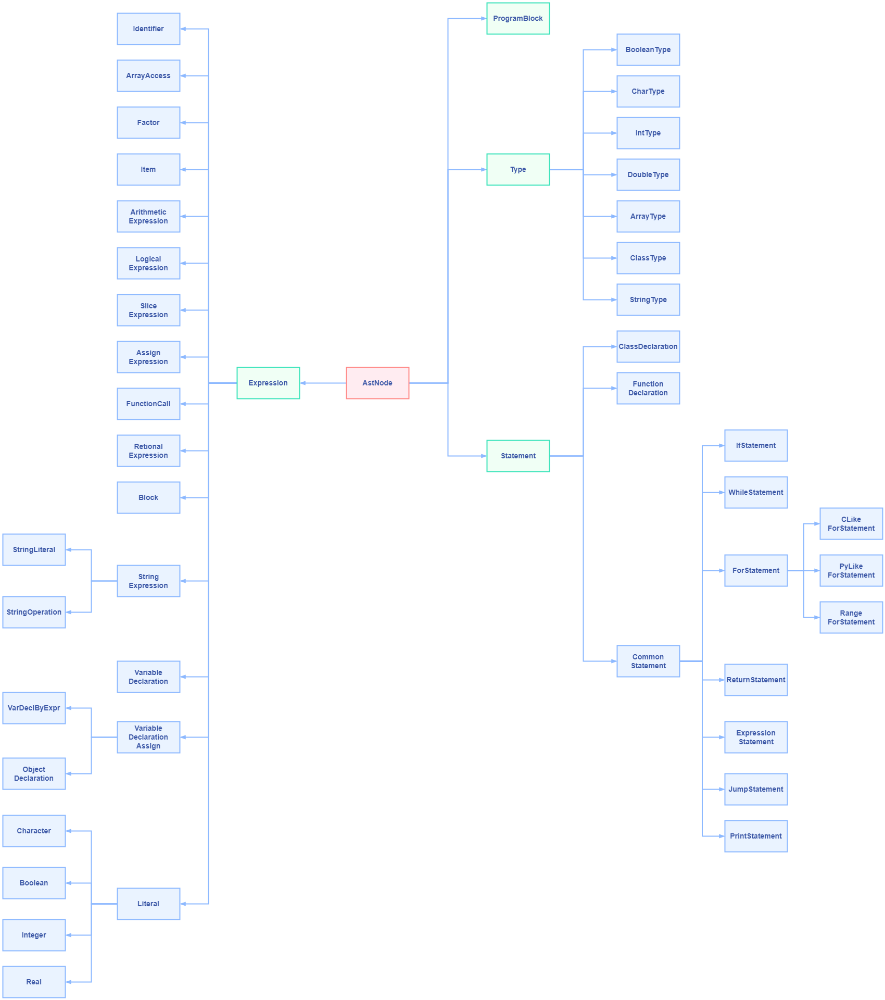

# 6 抽象语法树节点设计
## 6.1 语法树节点示意图

## 6.2 语法树节点说明

如图所示，AstNode为所有节点的根节点，所有节点都继承于AstNode。

剩余的节点可分为4大类：
+ ProgramBlock

 抽象语法树的开始节点，用于保存程序中的所有语句。

+ Type

 表示语言中的的基本类型，包括boolean、char、int、double、array、class、string。

+ Statement

 包括语言中所有的合法语句，分为类声明、函数声明、普通语句。普通语句包括循环语句、返回语句、表达式语句、跳转语句、打印语句。

+ Expression

 包括语言中支持的所有表达式，分为标识符、数组访问、因子、项、算术表达式、逻辑表达式、切片表达式、赋值表达式、函数调用、关系表达式、语句块、字符串表达式、变量声明、变量声明并定义。